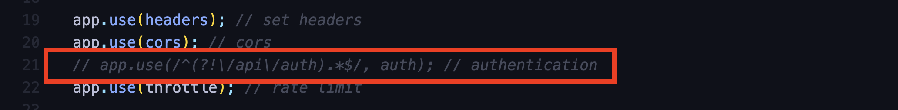

# Setup

1. create a `.env` configure database connection (check `.env.example` for more information)

   ```
   DB_CONNECTION=mysql
   DB_HOST=
   DB_PORT=
   DB_DATABASE=
   DB_USERNAME=
   DB_PASSWORD=
   ```

2. Generate a JWT secret by running this command

   ```
   openssl rand -base64 32
   ```

   Then copy the generated secret into `.env` file

   ```
   JWT_SECRET=
   ```

3. To enable authentication uncomment the following line in '`index.js` (optional)

   

4. To login make a post request to `http://localhost:9001/api/auth/login`. (optional)

   Request Body

   ```
   {
       email: "admin@example.com",
       password: "password"
   }
   ```

5. Start the application by running:

   ```
   npm install
   npm run migrate fresh -- --seed
   npm run dev
   ```

# Unit Testing

1. Stop the application

2. Create a `.env.test` configure database connection for testing

   ```
   DB_CONNECTION=mysql
   DB_HOST=
   DB_PORT=
   DB_DATABASE=
   DB_USERNAME=
   DB_PASSWORD=
   ```

3. Run database migrations in testing environment

   ```
   npm run migrate fresh -- --seed --env=test
   ```

4. If the authentication is activated, generate JWT token by making a post request to `http://localhost:9001/api/auth/login`.

   Request Body

   ```
   {
       email: "admin@example.com",
       password: "password"
   }
   ```

5. Copy the JWT token into `.env.test`

   ```
   API_KEY=
   ```

6. Restart the application in test mode

   ```
   npm run dev -- --env=test
   ```

7. Run tests

   ```
   npm run test
   ```

   Happy coding 🧑🏻‍💻🚀
